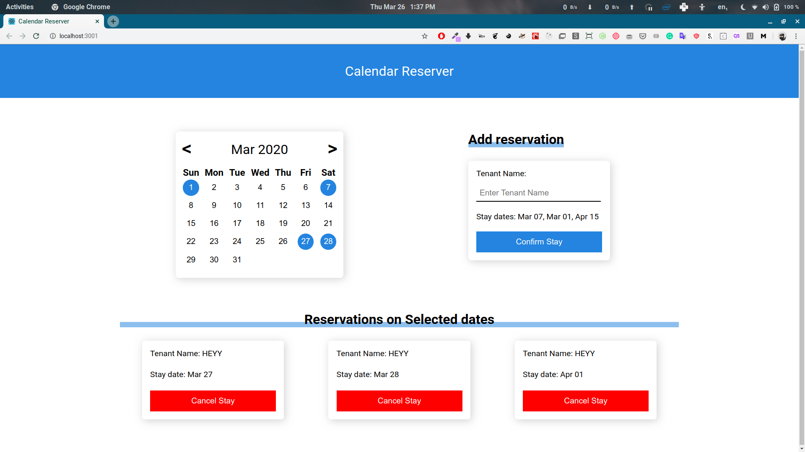
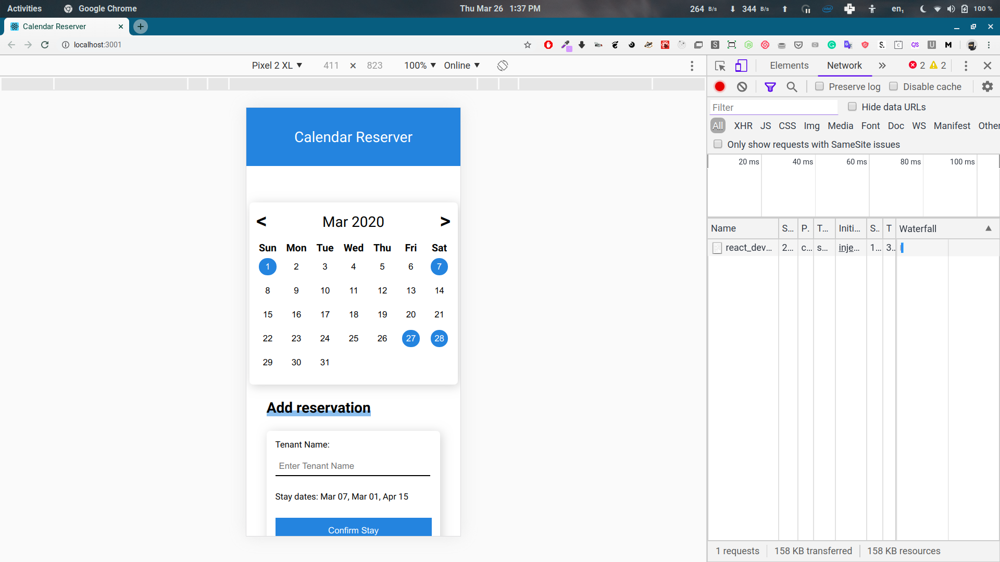

This project was bootstrapped with [Create React App](https://github.com/facebook/create-react-app).

It should be used with this server https://github.com/ravikp7/reservation-calendar with the updated `/reserve` api to change reservation. It has been updated to take an array of reservation objects instead of a single object.

# Calendar Reserver

## Available Scripts

In the project directory, you can run:

### 1. `yarn` or `npm install`

### 2. `yarn start` or `npm start`

Runs the app in the development mode. 
Open [http://localhost:3000](http://localhost:3000) to view it in the browser.

The page will reload if you make edits. 
You will also see any lint errors in the console.

